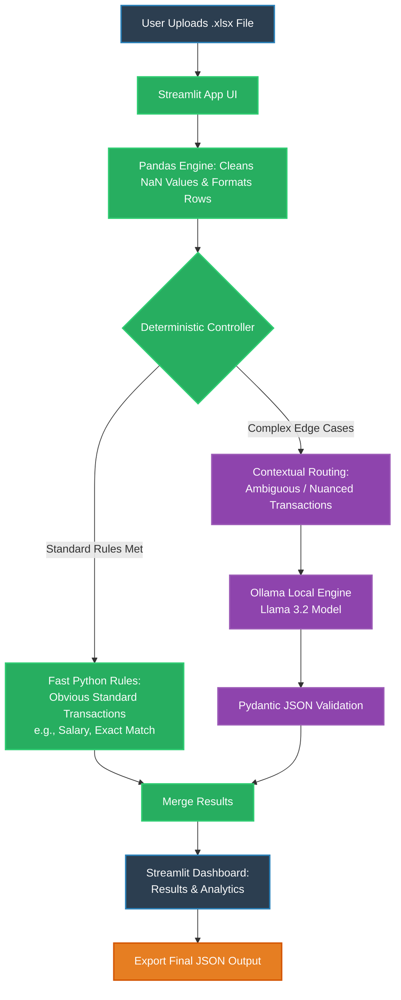

# 1. Project Name
VYOM+ Neural Ledger

# 2. Problem Statement
Financial accounting requires the accurate classification of complex, multi-field transactions into specific voucher categories. Relying on manual data entry to distinguish semantically similar transactions (e.g., distinguishing an internal 'Contra' transfer from a third-party 'Payment') is highly error-prone, slow, and computationally expensive if routed entirely through traditional, monolithic LLM prompts.

# 3. Project Overview
Neural Ledger is an end-to-end, locally hosted financial classification pipeline designed for high-speed batch processing. It ingests unstructured Excel datasets missing voucher types and processes them through a hybrid architecture—combining deterministic Python filtering with localized AI reasoning—to output structured, machine-readable JSON accounting data.

# 4. Proposed Solution
We propose a lightweight, two-stage hybrid engine optimized for a 10-hour hackathon development sprint.

* **Deterministic Layer**: A fast Python rule-filter handles obvious transactions (e.g., Salary/Payroll, strict internal bank transfers) instantly, ensuring high computational efficiency.

* **Contextual Layer**: Ambiguous rows are routed to a localized open-source LLM, which utilizes Few-Shot prompt matrices to evaluate nuanced accounting edge cases, returning a validated JSON object with a confidence score.

# 5. Objectives
* Accurately classify raw transaction rows across 26+ target voucher categories.

* Guarantee 100% structured JSON outputs without conversational text hallucinations.

* Minimize average inference time per row by bypassing the LLM for standard transactions.

* Provide an intuitive Streamlit interface for evaluators to upload files, view analytical summaries, and export data.

# 6. Target Users / Use Case
Enterprise accounting teams, financial auditors, and ERP administrators who need to automate the triage and classification of thousands of unstructured transactional rows before ingesting them into downstream accounting ledgers (e.g., Tally, SAP).

# 7. Open-Source AI Technology Selected
* **Model**: Llama 3.2 (or Qwen/Gemma variants)

* **Inference Framework**: Ollama (Local Execution)

# 8. Why This Technology Was Selected
Financial data contains sensitive internal metrics that cannot be sent to proprietary cloud APIs (like OpenAI). Running Llama 3.2 locally via Ollama ensures complete data sovereignty. Furthermore, the Llama 3.2 architecture is highly responsive to strict schema enforcement via Pydantic, which is critical for generating programmatic JSON outputs.

# 9. AI's Role in the System
The AI does not function as a chatbot; it operates as a headless, backend reasoning engine. It acts as a specialized "Financial Auditor Tool." It reads a domain-specific System Prompt, analyzes the context of conflicting transaction fields (e.g., analyzing buyer, seller, and tax values simultaneously), and predicts the exact voucher category when deterministic rules fail.

# 10. System Architecture
Our architecture is designed for feasibility and execution by a two-person engineering unit:

* **Ingestion & UI**: Streamlit interface for file uploading and progress tracking.

* **Data Processor**: Pandas engine to clean missing NaN values and format rows.

* **Routing Controller**: Python logic gates to split clear-cut data from ambiguous data.

* **Intelligence Core**: Ollama instance processing targeted Few-Shot prompts.

* **Validation**: Pydantic enforcing strict JSON compliance.

# 11. Component-Level Architecture

# 12. Data/Information Flow
* User uploads a raw .xlsx dataset via the Streamlit browser UI.

* Pandas parses the dataframe, neutralizes blank/dirty fields, and iterates through rows.

* The deterministic controller intercepts explicit rows (e.g., explicit payroll markers).

* Unclassified rows are formatted into context strings and sent to the local LLM.

* The LLM evaluates the row against the Few-Shot accounting decision matrix.

* The model returns a strictly formatted JSON object (Voucher Type, Confidence, Reasoning).

* Streamlit merges the deterministic and AI-classified results into a final exportable JSON.

# 13. Agentic Workflow (if applicable)
The system operates as a single-agent orchestrator. The central Python script acts as the manager, utilizing the LLM exclusively as a specialized sub-routine for contextual disambiguation.

# 14. Technology Stack
* **Language**: Python 3.11+

* **Data Processing**: Pandas, openpyxl

* **UI Framework**: Streamlit

* **AI Inference**: Ollama (Local)

* **Validation & Formatting**: Pydantic

# 15. Expected features
* Robust handling of dirty/missing transaction data.

* Hybrid routing to maximize inference speed.

* AI-generated confidence scores and transparent rationales for auditing.

* Real-time progress UI and one-click standardized JSON export.

# 16. Implementation Approach
* **Developer 1 (Pipeline/UI):** Constructs the Pandas ingestion pipeline, handles null-value fallback logic, builds the deterministic rule-filter, and finalizes the Streamlit dashboard.

* **Developer 2 (AI/Domain Logic):** Translates the 26+ voucher categories into a logical decision tree, constructs the Few-Shot System Prompts, implements the Pydantic schema, and conducts QA tuning against the Llama 3.2 model.

# 17. Expected Final Output
A localized, fully functioning Streamlit web application capable of processing a hidden evaluator dataset, instantly rendering a classification table, and generating a compliant JSON file with reasoning and confidence scores.

# 18. Future Scope / Scalability
The modular nature of the Python/Pydantic pipeline allows this exact logic engine to be seamlessly connected to downstream OCR invoice-extraction APIs, enabling a fully human-less, end-to-end ledger automation tool.

# 19. Open-Source Dependencies / Components
* pandas (BSD-3-Clause)

* streamlit (Apache 2.0)

* ollama-python (MIT)

* pydantic (MIT)

* openpyxl (MIT)

* Llama 3.2 Weights (Llama 3.2 Community License)

# 20. Expected Challenges and Mitigation
* **Challenge:** LLM hallucinating conversational text instead of valid data structures.

    **Mitigation:** Utilizing Ollama's structured output API combined with Pydantic classes to physically constrain the model's output to valid JSON.

* **Challenge**: Distinguishing semantically similar categories (e.g., Contra vs. Payment).

    **Mitigation**: Relying on deep domain research to inject explicit, Few-Shot decision matrices directly into the System Prompt.

* **Challenge**: Model crashing on incomplete real-world data.

    **Mitigation**: Implementing aggressive Pandas preprocessing to sanitize all NaN values before they reach the model context.